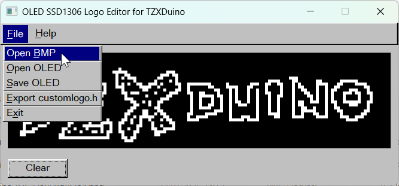

# OLED SSD1306 Logo Editor for TZXDuino

**License:** MIT  
**Author:** emarti (Murat Özdemir)

A lightweight Rust + FLTK desktop application to create, edit, and export custom logos for SSD1306 128×32 OLED displays used in the TZXDuino project.



## Features

### ✔️ 128×32 Monochrome Canvas

-   A pixel-perfect 128×32 workspace.
    
-   Each pixel is displayed with a 4×4 scale for easier editing.
    

### ✔️ Pixel Editing

-   **Left click:** turn pixel ON
    
-   **Right click:** turn pixel OFF
    
-   **Drag support:** draw or erase by dragging the mouse
    

### ✔️ Import BMP Images

-   `File → Open BMP`
    
-   Automatically scales any BMP image to 128×32
    
-   Converts colors to black/white using luminance threshold
    

### ✔️ Save / Load OLED Format

-   `File → Save OLED` saves a `.oled` file in SSD1306 page format
    
-   `File → Open OLED` loads a previously saved `.oled` file
    

### ✔️ Export `customlogo.h`

-   `File → Export customlogo.h`
    
-   Generates a C header file containing the logo byte array in SSD1306 page format
    
-   Output format:
    

```c
const byte logo [] PROGMEM = { 0x00, 0xFF, ...
};
```

### ✔️ Clear Button

-   Clears the canvas with one click
    

### ✔️ Simple Menu Interface

-   **File**
    
    -   Open BMP
        
    -   Open OLED
        
    -   Save OLED
        
    -   Export customlogo.h
        
    -   Exit
        
-   **Help**
    
    -   About

## How to Use in TZXDuino
To use the exported `customlogo.h` in the TZXDuino project:

1.  **Save the exported `customlogo.h` file into the root directory of the TZXDuino project.**
    
2.  Open `userconfig.h`.
    
3.  Add or uncomment the following line:
    

```c
#define CUSTOM_LOGO
```

4.  If you want to use the **standard logo**, comment this line:
    

```c
//#define CUSTOM_LOGO
```

## License
This project is released under the **MIT License**.